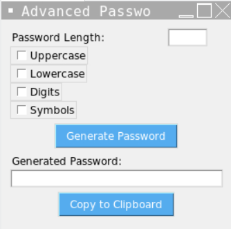

# Advanced Password Generator

This is a Python script that generates strong and secure passwords with an intuitive graphical user interface (GUI). It allows users to customize the password complexity, adherence to security rules, and includes clipboard integration for easy copying.

## Key Features

1. **Randomization:** Generates random characters and strings to create unique passwords.
2. **User Input Validation:** Validates user input for password length and character types.
3. **Character Set Handling:** Manages different character sets such as letters, numbers, and symbols.
4. **GUI Design:** Provides an intuitive and user-friendly interface for password generation.
5. **Security Rules:** Implements rules for generating strong and secure passwords.
6. **Clipboard Integration:** Allows users to copy generated passwords to the clipboard for convenience.
7. **Customization:** Enables users to customize password generation further, e.g., excluding specific characters.

## How to Use

1. **Installation:**
   - Clone this repository to your local machine.
   - Make sure you have Python installed on your system.

2. **Run the Script:**
   - Navigate to the directory where the script is located.
   - Run the script using the command: `python password_generator.py`.

3. **Generate Passwords:**
   - Specify the desired password length.
   - Check the character types you want to include in the password (uppercase, lowercase, digits, symbols).
   - Click on the "Generate Password" button to generate a password.
   - The generated password will be displayed in the text field.
   
4. **Copy to Clipboard:**
   - Click on the "Copy to Clipboard" button to copy the generated password to your clipboard.

## Dependencies

- Python 3.x
- tkinter (for GUI)
- pyperclip (for clipboard integration)

## Screenshots

</img>

## [+] Find Me On :

## Visiter

